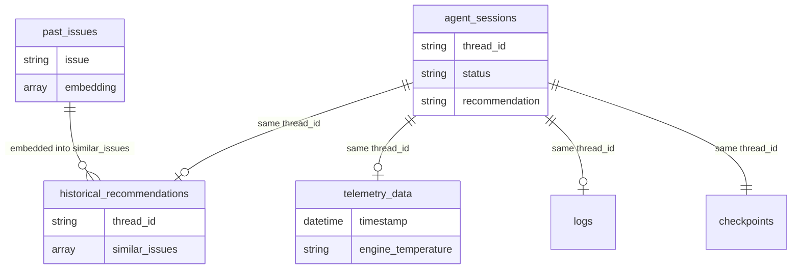

# EDD — Entity Document Diagram

MongoDB data model for the Connected Fleet Incident Advisor.

Two databases, both reached through connection strings built from `MONGO_URI`:
`DATABASE` (`fleet_issues` in the example `.env`) for the agent's own data, and the
fixed `checkpointing_db` for LangGraph's `MongoDBSaver`. Every collection below is
created implicitly on first write — there are no JSON Schema validators anywhere in
this repo, so field types below were derived from live documents in the seeded
database, not from a formal schema.

---

## Entity overview

| Collection | Database | Written by | Read by | Vector index |
| --- | --- | --- | --- | --- |
| `agent_profiles` | `fleet_issues` | `get_agent_profile()`, creates a default on first run | `generate_chain_of_thought()` | none |
| `past_issues` | `fleet_issues` | `create_issue_embeddings.py` | `vector_search_tool()` | `issues_index` |
| `agent_sessions` | `fleet_issues` | `run_agent` route, once per request | `resume_agent`, `get_sessions`, `get_run_documents` routes | none |
| `historical_recommendations` | `fleet_issues` | `get_llm_recommendation()` | `get_run_documents` route | none |
| `telemetry_data` | `fleet_issues` | `persist_data_to_mongodb()` | `get_run_documents` route | none |
| `logs` | `fleet_issues` | `persist_data_to_mongodb()` | `get_run_documents` route | none |
| `checkpoints` / `checkpoint_writes` | `checkpointing_db` | `MongoDBSaver` (LangGraph) | LangGraph, `get_run_documents` route | none |

## `agent_profiles`

Exactly one document exists in the seeded database (`default_agent`), created
automatically by `get_agent_profile()` if missing.

| Field | Type | Notes |
| --- | --- | --- |
| `_id` | ObjectId | |
| `agent_id` | string | Looked up by this key, e.g. `"default_agent"` |
| `profile` | string | Human-readable name |
| `instructions` | string | |
| `rules` | string | |
| `goals` | string | |

## `past_issues`

Seed data for the vector search demo — one document per known issue/recommendation
pair.

| Field | Type | Notes |
| --- | --- | --- |
| `_id` | ObjectId | |
| `issue` | string | e.g. `"Engine knocking when turning"` |
| `recommendation` | string | |
| `embedding` | array\<double\>, len=1024 | `voyage-3-large`, default dimensionality |

Vector index `issues_index` (created by `create_vector_index.py`, `type: "vectorSearch"`):

| Path | Type | Dimensions | Similarity |
| --- | --- | --- | --- |
| `embedding` | vector | 1024 | cosine |

## `agent_sessions`

One document per `/api/run-agent` call.

| Field | Type | Notes |
| --- | --- | --- |
| `_id` | ObjectId | |
| `thread_id` | string | `thread_YYYYMMDD_HHMMSS`, shared with the LangGraph checkpointer's `thread_id` |
| `issue_report` | string | |
| `created_at` | datetime | |
| `status` | string | `"completed"` or `"error"` |
| `recommendation` | string | Only present when `status: "completed"` |
| `error_message` | string | Only present when `status: "error"` |

## `historical_recommendations`

| Field | Type | Notes |
| --- | --- | --- |
| `_id` | ObjectId | |
| `thread_id` | string | |
| `timestamp` | datetime | |
| `issue_report` | string | |
| `telemetry_data` | array\<object\> | Snapshot of the telemetry CSV rows used for this run |
| `similar_issues` | array\<object\> | ⚠️ Full `past_issues` match documents, **including each one's 1024-value `embedding` array** — see Known inconsistencies |
| `recommendation` | string | |

## `telemetry_data`

A time-series collection (`timeField: timestamp`, `granularity: minutes`), created on
first write by `persist_data_to_mongodb()` if it doesn't already exist.

| Field | Type | Notes |
| --- | --- | --- |
| `_id` | ObjectId | |
| `timestamp` | datetime | Parsed from the CSV's `%Y-%m-%dT%H:%M:%SZ` strings |
| `thread_id` | string | |
| `engine_temperature` | ⚠️ string | Raw CSV value, never cast to a number — see Known inconsistencies |
| `oil_pressure` | ⚠️ string | Same |
| `avg_fuel_consumption` | ⚠️ string | Same |

## `logs`

| Field | Type | Notes |
| --- | --- | --- |
| `_id` | ObjectId | |
| `thread_id` | string | |
| `issue_report` | string | |
| `similar_issues` | array\<object\> | Same embedding-bloat issue as `historical_recommendations.similar_issues` |
| `created_at` | datetime | |

## `checkpointing_db.checkpoints` / `checkpointing_db.checkpoint_writes`

Managed entirely by `langgraph-checkpoint-mongodb`'s `MongoDBSaver`. `checkpoint` and
`value` are the serialized graph state (bytes) — treat as opaque, don't hand-edit.
Keyed by `thread_id`, the same value stored in `agent_sessions.thread_id`.

---

## Relationships

All relationships are logical only — joined by `thread_id`, never enforced by a
foreign key or index.

## Known inconsistencies

1. **`historical_recommendations.similar_issues` and `logs.similar_issues` store the
   full `past_issues` match documents, embeddings included.** `vector_search_tool()`'s
   `$vectorSearch` aggregation has no `$project` stage to drop `embedding` before
   returning results, so every historical recommendation and log entry carries three
   1024-value float arrays it never uses. Harmless at 5 seed documents; would bloat
   fast at real scale. Fix: add `{"$project": {"embedding": 0}}` (or project only the
   fields actually used) to the pipeline in `main.py`'s `vector_search_tool()`.
2. **`telemetry_data`'s numeric fields are stored as strings.** `get_telemetry_tool()`
   reads the CSV with `csv.DictReader` and never casts `engine_temperature`,
   `oil_pressure`, or `avg_fuel_consumption` to a number before persisting. The app
   works around this by calling `float()` at the point of use (e.g.
   `route_by_telemetry_severity`, `get_llm_recommendation`), but any direct MongoDB
   query or aggregation expecting numeric comparison on these fields (e.g. `$gt`) will
   silently return nothing, since string comparison isn't numeric comparison.

Update this section if either is fixed — otherwise it becomes misleading.
